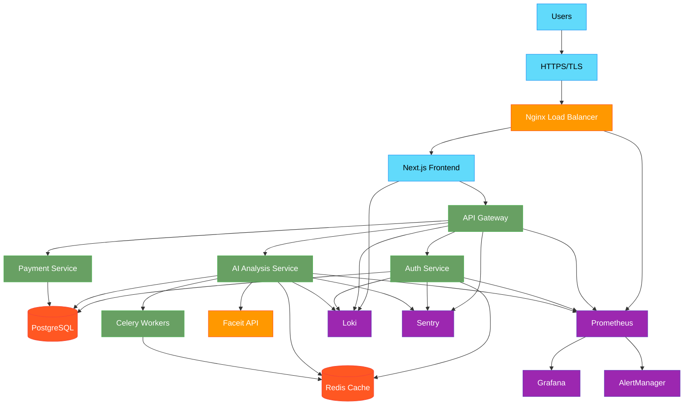
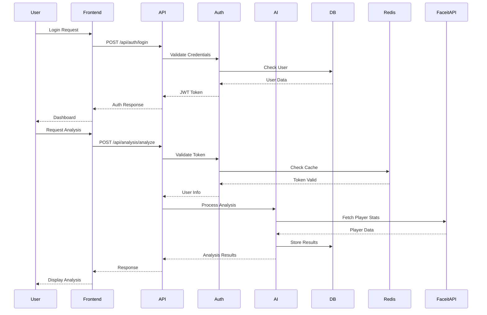
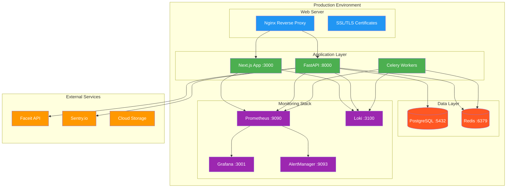
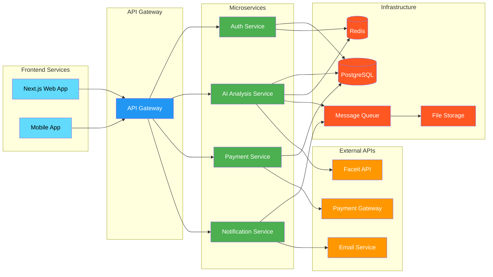
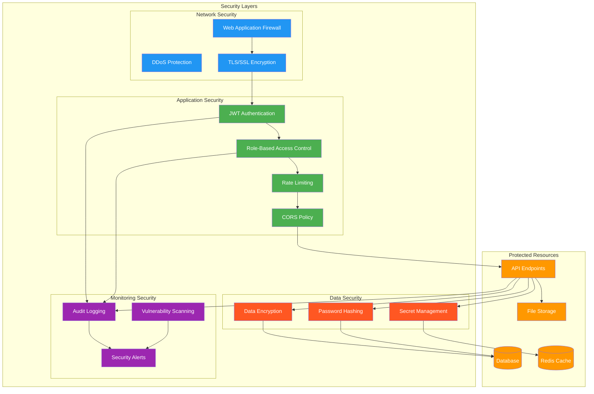
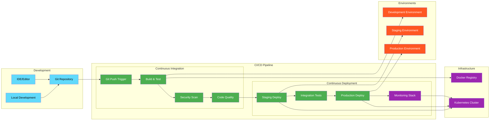

# Faceit AI Bot Architecture

## System Architecture Overview

## Data Flow Architecture

## Deployment Architecture

## Service Communication

## Security Architecture

## CI/CD Pipeline Architecture

